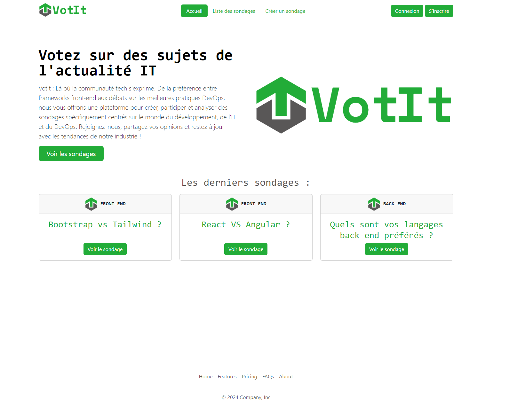
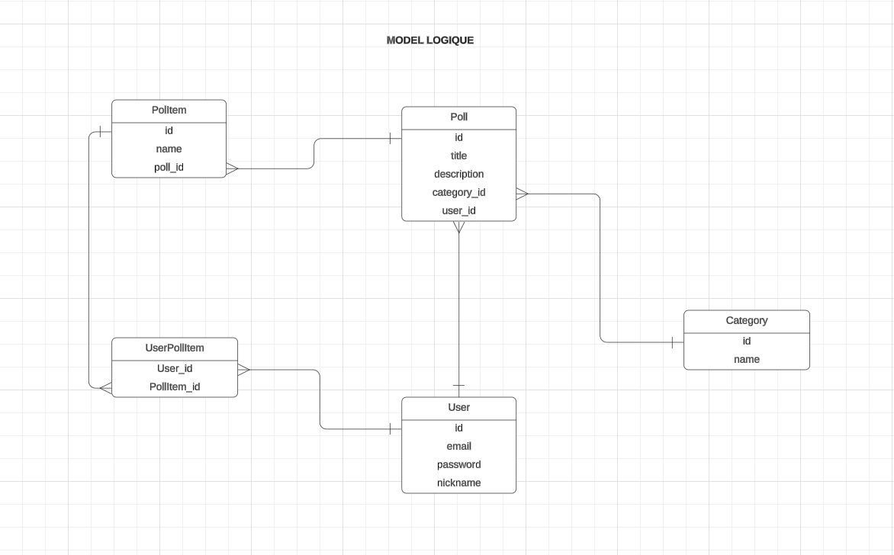

# VotIt

VotIt est une plateforme de sondages axée sur le domaine de l'informatique, du développement logiciel et du DevOps, où la communauté tech peut s'exprimer, participer à des débats, et suivre les tendances de l'industrie.

## Contexte

Ce projet a été réalisé dans le cadre de ma formation de [Bachelor Développeur Angular] chez [Studi] dans le but de mettre en pratique mes compétences en développement web backend et frontend en utilisant le langage PHP.
Il s'agit d'un projet complet qui couvre plusieurs aspects du développement logiciel, y compris la prise en charge du "brief du client" la définition et la concéption de la Base de donnée, la logique métier backend, et l'interface utilisateur frontend.

## Description

VotIt est un projet PHP Vanilla, développé à 100% en PHP sans utiliser de frameworks ou de bibliothèques externes. Cette approche a été choisie pour permettre une compréhension approfondie du langage PHP et pour offrir une expérience de développement purement personnalisée.

## Fonctionnalités

- **Création de sondages** : Les utilisateurs peuvent créer des sondages sur des sujets de leur choix, en ajoutant des questions, des options de réponse, et une description détaillée.
- **Participation aux sondages** : Les membres de la communauté peuvent voter pour les options qui leur conviennent le mieux et voir les résultats en temps réel.
- **Analyse des résultats** : Les résultats des sondages sont présentés de manière claire et interactive, avec des graphiques et des statistiques pour une compréhension facile.
- **Authentification des utilisateurs** : Les utilisateurs peuvent s'inscrire, se connecter et gérer leur compte, ce qui leur permet de suivre leurs activités de sondage et de recevoir des notifications.

## Technologies utilisées

- **Backend** :
  - PHP : Langage de programmation pour la logique backend et l'accès à la base de données.
  - MySQL : Base de données relationnelle pour stocker les données des utilisateurs, des sondages et des votes.
- **Frontend** :
  - HTML/CSS: Langages de programmation frontend pour l'interface utilisateur et l'interaction.
  - Bootstrap : Framework CSS pour le design réactif et la mise en page.
- **Outils de développement** :
  - Git : Système de contrôle de version pour la collaboration et le suivi des modifications.
  - GitHub : Plateforme d'hébergement de code pour le stockage du projet et la collaboration.

## Installation

1. Clonez ce dépôt sur votre machine locale

2. Configurez votre serveur web pour exécuter le code PHP.
3. Importez la base de données `votit.sql` dans votre système de gestion de base de données MySQL.
4. Modifiez les informations de connexion à la base de données dans le fichier `lib/config.php`.
5. Lancez l'application dans votre navigateur en accédant à l'URL correspondante.

## (todo after : reset.php)..........

## .............

